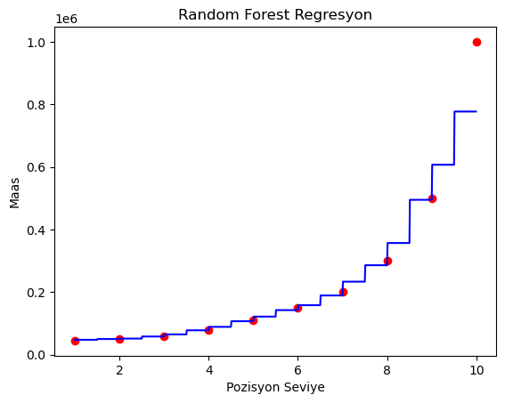

# Random Forest Ile Maas Tahmini

Bu projede Random Forest algoritmasını pekiştirmek için örnek bir uygulama yaptım. Random Forest algoritması ile veri setimizin içerisindeki personelin pozisyon ve seviyesine göre maaşını tahmin etmeyi amaclandı. 

Random Forest algoritmasının veri setine uygulanmış bir şekilde grafik çıktısı :

## Contact

 Beni [LinkedIn](https://www.linkedin.com/in/muhammed-talha-bıçak) üzerinden takip edebilirsiniz.

 GitHub üzerinden takip edebilir ve mesaj gönderebilirsiniz: [@talha-bicak](https://github.com/talha-bicak)

